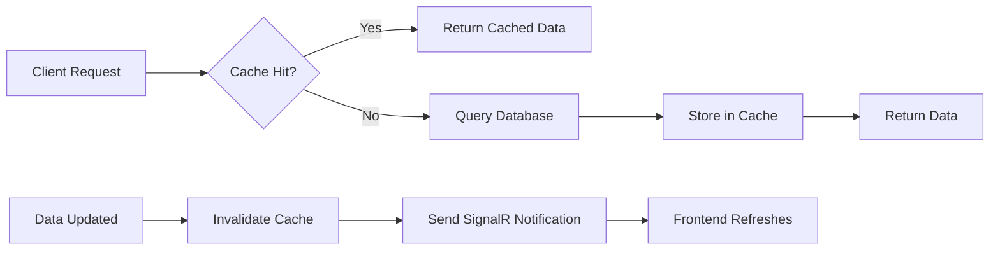

# Caching Database Data - Practical Guide

## Overview

This guide shows you how to implement caching for database queries to improve performance and reduce database load.

---

## Quick Start

### 1. Inject ICacheService

```csharp
public class UserService : IUserService
{
    private readonly ApplicationDbContext _context;
    private readonly ICacheService _cache;
    private readonly IMapper _mapper;

    public UserService(
        ApplicationDbContext context,
        ICacheService cache,
        IMapper mapper)
    {
        _context = context;
        _cache = cache;
        _mapper = mapper;
    }
}
```

### 2. Cache a Simple Query

```csharp
public async Task<UserDto> GetUserByIdAsync(Guid userId)
{
    // Define cache key
    var cacheKey = CacheKeys.User(userId);

    // Try to get from cache
    var cachedUser = await _cache.GetAsync<UserDto>(cacheKey);
    if (cachedUser != null)
    {
        return cachedUser; // Cache hit!
    }

    // Cache miss - fetch from database
    var user = await _context.Users
        .FirstOrDefaultAsync(u => u.Id == userId);

    if (user == null)
    {
        throw new NotFoundException(nameof(User), userId);
    }

    var userDto = _mapper.Map<UserDto>(user);

    // Store in cache for 15 minutes
    await _cache.SetAsync(cacheKey, userDto, TimeSpan.FromMinutes(15));

    return userDto;
}
```

---

## Caching Patterns

### Pattern 1: Cache-Aside (Lazy Loading)

**Best for**: Frequently read, infrequently updated data

```csharp
public async Task<List<BranchDto>> GetTenantBranchesAsync(Guid tenantId)
{
    var cacheKey = CacheKeys.TenantBranches(tenantId);

    // GetOrCreateAsync handles cache-aside pattern automatically
    return await _cache.GetOrCreateAsync(
        key: cacheKey,
        factory: async () =>
        {
            // This only runs on cache miss
            var branches = await _context.Branches
                .Where(b => b.TenantId == tenantId && b.IsActive)
                .OrderBy(b => b.Name)
                .ToListAsync();

            return _mapper.Map<List<BranchDto>>(branches);
        },
        expiration: TimeSpan.FromMinutes(30)
    );
}
```

### Pattern 2: Write-Through Cache

**Best for**: Data that must be consistent

```csharp
public async Task<Result> UpdateUserAsync(UpdateUserDto dto)
{
    // Update database
    var user = await _context.Users.FindAsync(dto.Id);
    _mapper.Map(dto, user);
    await _context.SaveChangesAsync();

    // Update cache immediately
    var userDto = _mapper.Map<UserDto>(user);
    var cacheKey = CacheKeys.User(user.Id);
    await _cache.SetAsync(cacheKey, userDto, TimeSpan.FromMinutes(15));

    return Result.Success();
}
```

### Pattern 3: Cache Invalidation on Write

**Best for**: When updates are less frequent than reads

```csharp
public async Task<Result> UpdateBranchAsync(UpdateBranchDto dto)
{
    // Update database
    var branch = await _context.Branches.FindAsync(dto.Id);
    _mapper.Map(dto, branch);
    await _context.SaveChangesAsync();

    // Invalidate cache - next read will fetch fresh data
    await _cache.RemoveAsync(CacheKeys.TenantBranches(branch.TenantId));

    return Result.Success();
}
```

### Pattern 4: Refresh-Ahead

**Best for**: Predictably accessed data

```csharp
public class CacheRefreshBackgroundService : BackgroundService
{
    protected override async Task ExecuteAsync(CancellationToken stoppingToken)
    {
        while (!stoppingToken.IsCancellationRequested)
        {
            // Refresh cache every 5 minutes
            await RefreshTenantConfigsAsync();
            await Task.Delay(TimeSpan.FromMinutes(5), stoppingToken);
        }
    }

    private async Task RefreshTenantConfigsAsync()
    {
        var tenants = await _context.Tenants
            .Where(t => t.IsActive)
            .ToListAsync();

        foreach (var tenant in tenants)
        {
            var config = _mapper.Map<TenantConfigDto>(tenant);
            await _cache.SetAsync(
                CacheKeys.TenantConfig(tenant.Id),
                config,
                TimeSpan.FromMinutes(60)
            );
        }
    }
}
```

---

## Practical Examples by Entity

### Caching Users

```csharp
public class UserService : IUserService
{
    // Get single user
    public async Task<UserDto> GetUserByIdAsync(Guid userId)
    {
        return await _cache.GetOrCreateAsync(
            CacheKeys.User(userId),
            async () =>
            {
                var user = await _context.Users
                    .Include(u => u.Branch)
                    .FirstOrDefaultAsync(u => u.Id == userId);

                return _mapper.Map<UserDto>(user);
            },
            TimeSpan.FromMinutes(15)
        );
    }

    // Get user permissions (frequently accessed)
    public async Task<List<string>> GetUserPermissionsAsync(Guid userId)
    {
        var cacheKey = CacheKeys.UserPermissions(userId);

        return await _cache.GetOrCreateAsync(
            cacheKey,
            async () =>
            {
                var permissions = await _context.Users
                    .Where(u => u.Id == userId)
                    .SelectMany(u => u.Roles)
                    .SelectMany(r => r.Permissions)
                    .Select(p => p.Name)
                    .Distinct()
                    .ToListAsync();

                return permissions;
            },
            TimeSpan.FromMinutes(15) // Refresh every 15 minutes
        );
    }

    // Update user - invalidate cache
    public async Task UpdateUserAsync(UpdateUserDto dto)
    {
        var user = await _context.Users.FindAsync(dto.Id);
        _mapper.Map(dto, user);
        await _context.SaveChangesAsync();

        // Invalidate related caches
        await _cache.RemoveAsync(CacheKeys.User(dto.Id));
        await _cache.RemoveAsync(CacheKeys.UserPermissions(dto.Id));
        await _cache.RemoveAsync(CacheKeys.UserRoles(dto.Id));
    }
}
```

### Caching Branches

```csharp
public class BranchService : IBranchService
{
    // Get all branches for a tenant
    public async Task<List<BranchDto>> GetTenantBranchesAsync(Guid tenantId)
    {
        var cacheKey = CacheKeys.TenantBranches(tenantId);

        return await _cache.GetOrCreateAsync(
            cacheKey,
            async () =>
            {
                var branches = await _context.Branches
                    .Where(b => b.TenantId == tenantId && b.IsActive)
                    .Include(b => b.Users)
                    .OrderBy(b => b.Name)
                    .ToListAsync();

                return _mapper.Map<List<BranchDto>>(branches);
            },
            TimeSpan.FromHours(1) // Branches don't change often
        );
    }

    // Create branch - invalidate cache
    public async Task<Guid> CreateBranchAsync(CreateBranchDto dto)
    {
        var branch = _mapper.Map<Branch>(dto);
        await _context.Branches.AddAsync(branch);
        await _context.SaveChangesAsync();

        // Invalidate tenant branches cache
        await _cache.RemoveAsync(CacheKeys.TenantBranches(branch.TenantId));

        return branch.Id;
    }
}
```

### Caching Lookup Data (Plans, Modules)

```csharp
public class PlanService : IPlanService
{
    // Plans change rarely - cache for longer
    public async Task<List<PlanDto>> GetAllPlansAsync()
    {
        var cacheKey = "plans:all";

        return await _cache.GetOrCreateAsync(
            cacheKey,
            async () =>
            {
                var plans = await _context.Plans
                    .Include(p => p.Limits)
                    .Include(p => p.PlanModules)
                        .ThenInclude(pm => pm.Module)
                    .Where(p => p.IsActive)
                    .OrderBy(p => p.Name)
                    .ToListAsync();

                return _mapper.Map<List<PlanDto>>(plans);
            },
            TimeSpan.FromHours(24) // Cache for 24 hours
        );
    }

    // Get single plan
    public async Task<PlanDto> GetPlanByIdAsync(Guid planId)
    {
        var cacheKey = CacheKeys.Plan(planId);

        return await _cache.GetOrCreateAsync(
            cacheKey,
            async () =>
            {
                var plan = await _context.Plans
                    .Include(p => p.Limits)
                    .Include(p => p.PlanModules)
                    .FirstOrDefaultAsync(p => p.Id == planId);

                return _mapper.Map<PlanDto>(plan);
            },
            TimeSpan.FromHours(24)
        );
    }
}
```

### Caching Paginated Results

```csharp
public class UserService
{
    public async Task<PaginatedList<UserDto>> GetUsersAsync(
        Guid tenantId,
        int page = 1,
        int pageSize = 20)
    {
        var cacheKey = CacheKeys.TenantUsers(tenantId, page, pageSize);

        return await _cache.GetOrCreateAsync(
            cacheKey,
            async () =>
            {
                var query = _context.Users
                    .Where(u => u.TenantId == tenantId && u.IsActive)
                    .OrderBy(u => u.FullName);

                var totalCount = await query.CountAsync();
                var items = await query
                    .Skip((page - 1) * pageSize)
                    .Take(pageSize)
                    .ToListAsync();

                var dtos = _mapper.Map<List<UserDto>>(items);

                return new PaginatedList<UserDto>(dtos, totalCount, page, pageSize);
            },
            TimeSpan.FromMinutes(10) // Shorter expiration for lists
        );
    }

    // When creating/updating a user, invalidate all pages
    public async Task CreateUserAsync(CreateUserDto dto)
    {
        var user = _mapper.Map<ApplicationUser>(dto);
        await _context.Users.AddAsync(user);
        await _context.SaveChangesAsync();

        // Invalidate all cached pages for this tenant
        // In a production app, you'd track page keys or use pattern matching
        await _cache.RemoveAsync(CacheKeys.TenantUsers(user.TenantId, 1, 20));
        await _cache.RemoveAsync(CacheKeys.TenantUsers(user.TenantId, 2, 20));
        // ... or invalidate tenant cache entirely
        await _cache.InvalidateTenantCacheAsync(user.TenantId);
    }
}
```

---

## Cache Helper Extension Methods

Create an extension class for easier caching:

**File**: `src/Infrastructure/Extensions/QueryCacheExtensions.cs`

```csharp
using HotelManagement.Application.Common.Interfaces;
using Microsoft.EntityFrameworkCore;

namespace HotelManagement.Infrastructure.Extensions;

public static class QueryCacheExtensions
{
    /// <summary>
    /// Executes query with caching
    /// </summary>
    public static async Task<List<T>> ToListCachedAsync<T>(
        this IQueryable<T> query,
        ICacheService cache,
        string cacheKey,
        TimeSpan? expiration = null)
    {
        return await cache.GetOrCreateAsync(
            cacheKey,
            async () => await query.ToListAsync(),
            expiration ?? TimeSpan.FromMinutes(30)
        );
    }

    /// <summary>
    /// Gets first or default with caching
    /// </summary>
    public static async Task<T?> FirstOrDefaultCachedAsync<T>(
        this IQueryable<T> query,
        ICacheService cache,
        string cacheKey,
        TimeSpan? expiration = null)
    {
        return await cache.GetOrCreateAsync(
            cacheKey,
            async () => await query.FirstOrDefaultAsync(),
            expiration ?? TimeSpan.FromMinutes(30)
        );
    }
}
```

**Usage**:

```csharp
// Before
var users = await _context.Users.Where(u => u.TenantId == tenantId).ToListAsync();

// After (with caching)
var users = await _context.Users
    .Where(u => u.TenantId == tenantId)
    .ToListCachedAsync(
        _cache,
        CacheKeys.TenantUsers(tenantId, 1, 100),
        TimeSpan.FromMinutes(15)
    );
```

---

## Real-World Integration Example

### Complete CRUD Service with Caching

```csharp
public class BranchService : IBranchService
{
    private readonly ApplicationDbContext _context;
    private readonly ICacheService _cache;
    private readonly IMapper _mapper;
    private readonly INotificationService _notifications;
    private readonly ITenantContext _tenantContext;
    private readonly ILogger<BranchService> _logger;

    public BranchService(
        ApplicationDbContext context,
        ICacheService cache,
        IMapper mapper,
        INotificationService notifications,
        ITenantContext tenantContext,
        ILogger<BranchService> logger)
    {
        _context = context;
        _cache = cache;
        _mapper = mapper;
        _notifications = notifications;
        _tenantContext = tenantContext;
        _logger = logger;
    }

    // CREATE - Cache the new item
    public async Task<Result<Guid>> CreateBranchAsync(CreateBranchDto dto)
    {
        try
        {
            var branch = _mapper.Map<Branch>(dto);
            branch.TenantId = _tenantContext.TenantId!.Value;

            await _context.Branches.AddAsync(branch);
            await _context.SaveChangesAsync();

            _logger.LogInformation("Branch created: {BranchId}", branch.Id);

            // Cache the new branch
            var branchDto = _mapper.Map<BranchDto>(branch);
            await _cache.SetAsync(
                CacheKeys.Branch(branch.Id),
                branchDto,
                TimeSpan.FromHours(1)
            );

            // Invalidate list cache
            await _cache.RemoveAsync(CacheKeys.TenantBranches(branch.TenantId));

            // Send real-time notification
            await _notifications.SendToTenantAsync(
                branch.TenantId,
                $"New branch created: {branch.Name}",
                new { branchId = branch.Id, branchName = branch.Name }
            );

            return Result<Guid>.Success(branch.Id);
        }
        catch (Exception ex)
        {
            _logger.LogError(ex, "Error creating branch");
            return Result<Guid>.Failure("Failed to create branch");
        }
    }

    // READ - Get from cache
    public async Task<BranchDto> GetBranchByIdAsync(Guid branchId)
    {
        var cacheKey = CacheKeys.Branch(branchId);

        return await _cache.GetOrCreateAsync(
            cacheKey,
            async () =>
            {
                var branch = await _context.Branches
                    .Include(b => b.Users)
                    .Include(b => b.Rooms)
                    .FirstOrDefaultAsync(b => b.Id == branchId);

                if (branch == null)
                {
                    throw new NotFoundException(nameof(Branch), branchId);
                }

                return _mapper.Map<BranchDto>(branch);
            },
            TimeSpan.FromHours(1)
        );
    }

    // UPDATE - Invalidate cache
    public async Task<Result> UpdateBranchAsync(UpdateBranchDto dto)
    {
        var branch = await _context.Branches.FindAsync(dto.Id);
        if (branch == null)
        {
            return Result.Failure("Branch not found");
        }

        _mapper.Map(dto, branch);
        await _context.SaveChangesAsync();

        // Invalidate caches
        await _cache.RemoveAsync(CacheKeys.Branch(branch.Id));
        await _cache.RemoveAsync(CacheKeys.TenantBranches(branch.TenantId));

        // Notify users
        await _notifications.SendToTenantAsync(
            branch.TenantId,
            $"Branch updated: {branch.Name}",
            new { branchId = branch.Id }
        );

        return Result.Success();
    }

    // DELETE - Invalidate cache
    public async Task<Result> DeleteBranchAsync(Guid branchId)
    {
        var branch = await _context.Branches.FindAsync(branchId);
        if (branch == null)
        {
            return Result.Failure("Branch not found");
        }

        _context.Branches.Remove(branch);
        await _context.SaveChangesAsync();

        // Invalidate caches
        await _cache.RemoveAsync(CacheKeys.Branch(branchId));
        await _cache.RemoveAsync(CacheKeys.TenantBranches(branch.TenantId));

        // Notify users
        await _notifications.SendToTenantAsync(
            branch.TenantId,
            $"Branch deleted: {branch.Name}",
            null
        );

        return Result.Success();
    }

    // LIST - Cache with pagination
    public async Task<PaginatedList<BranchDto>> GetBranchesAsync(
        int page = 1,
        int pageSize = 20)
    {
        var tenantId = _tenantContext.TenantId!.Value;
        var cacheKey = $"tenant:{tenantId}:branches:page_{page}_{pageSize}";

        return await _cache.GetOrCreateAsync(
            cacheKey,
            async () =>
            {
                var query = _context.Branches
                    .Where(b => b.TenantId == tenantId && b.IsActive)
                    .OrderBy(b => b.Name);

                var total = await query.CountAsync();
                var items = await query
                    .Skip((page - 1) * pageSize)
                    .Take(pageSize)
                    .ToListAsync();

                var dtos = _mapper.Map<List<BranchDto>>(items);

                return new PaginatedList<BranchDto>(dtos, total, page, pageSize);
            },
            TimeSpan.FromMinutes(30)
        );
    }
}
```

---

## Cache Helper Class (Extend CacheKeys)

Add these to `src/Infrastructure/Services/CacheService.cs`:

```csharp
public static class CacheKeys
{
    // Existing keys...
    public static string TenantConfig(Guid tenantId) => $"tenant:{tenantId}:config";
    public static string TenantPermissions(Guid tenantId) => $"tenant:{tenantId}:permissions";
    public static string UserPermissions(Guid userId) => $"user:{userId}:permissions";
    public static string UserRoles(Guid userId) => $"user:{userId}:roles";
    public static string TenantBranches(Guid tenantId) => $"tenant:{tenantId}:branches";
    
    // Add these new ones:
    public static string User(Guid userId) => $"user:{userId}";
    public static string Branch(Guid branchId) => $"branch:{branchId}";
    public static string Room(Guid roomId) => $"room:{roomId}";
    public static string Reservation(Guid reservationId) => $"reservation:{reservationId}";
    
    public static string TenantUsers(Guid tenantId, int page, int pageSize) => 
        $"tenant:{tenantId}:users:page_{page}_{pageSize}";
    
    public static string TenantRooms(Guid tenantId, Guid branchId) => 
        $"tenant:{tenantId}:branch:{branchId}:rooms";
    
    public static string AvailableRooms(Guid branchId, DateTime date) => 
        $"branch:{branchId}:available_rooms:{date:yyyyMMdd}";
    
    public static string TenantStats(Guid tenantId) => 
        $"tenant:{tenantId}:stats";
    
    public static string DashboardData(Guid tenantId, string userId) => 
        $"tenant:{tenantId}:user:{userId}:dashboard";
}
```

---

## Caching Complex Queries

### Example: Dashboard Statistics

```csharp
public class DashboardService
{
    public async Task<DashboardStatsDto> GetDashboardStatsAsync(Guid tenantId)
    {
        var cacheKey = CacheKeys.TenantStats(tenantId);

        return await _cache.GetOrCreateAsync(
            cacheKey,
            async () =>
            {
                // Expensive aggregation queries
                var stats = new DashboardStatsDto
                {
                    TotalReservations = await _context.Reservations
                        .CountAsync(r => r.TenantId == tenantId),
                    
                    ActiveReservations = await _context.Reservations
                        .CountAsync(r => r.TenantId == tenantId && r.Status == "Active"),
                    
                    TotalRevenue = await _context.Reservations
                        .Where(r => r.TenantId == tenantId)
                        .SumAsync(r => r.TotalAmount),
                    
                    OccupancyRate = await CalculateOccupancyRateAsync(tenantId),
                    
                    RecentReservations = await _context.Reservations
                        .Where(r => r.TenantId == tenantId)
                        .OrderByDescending(r => r.CreatedAt)
                        .Take(5)
                        .ToListAsync()
                };

                return stats;
            },
            TimeSpan.FromMinutes(5) // Refresh every 5 minutes
        );
    }

    // When a reservation is created/updated, invalidate stats
    public async Task OnReservationChangedAsync(Guid tenantId)
    {
        await _cache.RemoveAsync(CacheKeys.TenantStats(tenantId));
        
        // Send real-time update to dashboard
        var freshStats = await GetDashboardStatsAsync(tenantId);
        await _notifications.SendToRoomAsync(
            tenantId,
            "dashboard",
            "dashboardStatsUpdated",
            freshStats
        );
    }
}
```

---

## Frontend Integration with Cache

### Next.js with SWR + Cache

```typescript
// hooks/useUsers.ts
import useSWR from 'swr';
import { signalRService } from '@/lib/signalr-service';
import { useEffect } from 'react';

export function useUsers() {
  const { data, mutate, isLoading } = useSWR(
    '/api/v1/users',
    fetcher,
    {
      revalidateOnFocus: false,
      dedupingInterval: 5000 // Client-side cache for 5s
    }
  );

  useEffect(() => {
    // Listen for real-time updates
    const handleUserUpdated = (notification: any) => {
      if (notification.data?.userId) {
        // Revalidate (refetch) when user changes
        mutate();
      }
    };

    signalRService.on('notification', handleUserUpdated);

    return () => {
      signalRService.off('notification', handleUserUpdated);
    };
  }, [mutate]);

  return {
    users: data,
    isLoading,
    refresh: mutate
  };
}
```

### MAUI with In-Memory Cache

```csharp
public class CachedUserService
{
    private readonly IApiClient _api;
    private readonly SignalRService _signalR;
    private readonly Dictionary<Guid, (UserDto User, DateTime Expiry)> _cache = new();
    private readonly TimeSpan _cacheDuration = TimeSpan.FromMinutes(5);

    public async Task<UserDto> GetUserAsync(Guid userId)
    {
        // Check in-memory cache
        if (_cache.TryGetValue(userId, out var cached))
        {
            if (cached.Expiry > DateTime.UtcNow)
            {
                return cached.User; // Cache hit
            }
            _cache.Remove(userId); // Expired
        }

        // Fetch from API
        var user = await _api.GetUserAsync(userId);

        // Store in cache
        _cache[userId] = (user, DateTime.UtcNow.Add(_cacheDuration));

        return user;
    }

    public void InvalidateUser(Guid userId)
    {
        _cache.Remove(userId);
    }

    public void SetupRealTimeInvalidation()
    {
        // Listen for user updates via SignalR
        _signalR.NotificationReceived += (sender, notification) =>
        {
            if (notification.Data is JsonElement element)
            {
                if (element.TryGetProperty("userId", out var userIdProp))
                {
                    if (Guid.TryParse(userIdProp.GetString(), out var userId))
                    {
                        InvalidateUser(userId);
                    }
                }
            }
        };
    }
}
```

---

## Best Practices

### 1. Always Include Tenant ID in Cache Keys

```csharp
// ✅ Good
var cacheKey = $"tenant:{tenantId}:branches";

// ❌ Bad - could leak data between tenants
var cacheKey = "branches";
```

### 2. Set Appropriate Expiration Times

```csharp
// Hot data - frequently accessed, frequently changes
TimeSpan.FromMinutes(5)    // Dashboard stats
TimeSpan.FromMinutes(15)   // User sessions, permissions

// Warm data - regularly accessed, occasionally changes
TimeSpan.FromMinutes(30)   // User lists, branch lists
TimeSpan.FromHours(1)      // Branch details, tenant config

// Cold data - rarely changes
TimeSpan.FromHours(24)     // Plans, modules, lookup data
```

### 3. Invalidate on Write Operations

```csharp
// Create, Update, Delete should all invalidate cache
public async Task UpdateAsync(UpdateDto dto)
{
    await _repository.UpdateAsync(dto);
    
    // Invalidate specific item
    await _cache.RemoveAsync(CacheKeys.Item(dto.Id));
    
    // Invalidate list
    await _cache.RemoveAsync(CacheKeys.TenantItems(dto.TenantId));
}
```

### 4. Handle Cache Failures Gracefully

```csharp
public async Task<UserDto> GetUserAsync(Guid userId)
{
    try
    {
        // Try cache first
        var cached = await _cache.GetAsync<UserDto>(CacheKeys.User(userId));
        if (cached != null) return cached;
    }
    catch (Exception ex)
    {
        _logger.LogWarning(ex, "Cache retrieval failed, falling back to database");
        // Continue to database query
    }

    // Always have database as fallback
    var user = await _context.Users.FindAsync(userId);
    return _mapper.Map<UserDto>(user);
}
```

### 5. Combine Caching with Notifications

```csharp
public async Task UpdateRoomStatusAsync(Guid roomId, string status)
{
    var room = await _context.Rooms.FindAsync(roomId);
    room.Status = status;
    await _context.SaveChangesAsync();

    // 1. Invalidate cache
    await _cache.RemoveAsync(CacheKeys.Room(roomId));
    await _cache.RemoveAsync(CacheKeys.TenantRooms(room.TenantId, room.BranchId));

    // 2. Update cache with new data (write-through)
    var roomDto = _mapper.Map<RoomDto>(room);
    await _cache.SetAsync(CacheKeys.Room(roomId), roomDto, TimeSpan.FromMinutes(30));

    // 3. Send real-time notification
    await _notifications.SendToBranchAsync(
        room.BranchId,
        $"Room {room.Number} status changed to {status}",
        new { roomId, status, roomNumber = room.Number }
    );
}
```

---

## Cache Monitoring

### Track Cache Performance

```csharp
public class CachedUserService : IUserService
{
    private long _cacheHits = 0;
    private long _cacheMisses = 0;

    public async Task<UserDto> GetUserAsync(Guid userId)
    {
        var cacheKey = CacheKeys.User(userId);
        var cached = await _cache.GetAsync<UserDto>(cacheKey);

        if (cached != null)
        {
            Interlocked.Increment(ref _cacheHits);
            _logger.LogDebug("Cache hit for user {UserId}. Hit rate: {HitRate}%",
                userId, GetHitRate());
            return cached;
        }

        Interlocked.Increment(ref _cacheMisses);
        _logger.LogDebug("Cache miss for user {UserId}. Hit rate: {HitRate}%",
            userId, GetHitRate());

        // Fetch from database and cache
        var user = await FetchFromDatabaseAsync(userId);
        await _cache.SetAsync(cacheKey, user, TimeSpan.FromMinutes(15));
        
        return user;
    }

    private double GetHitRate()
    {
        var total = _cacheHits + _cacheMisses;
        return total == 0 ? 0 : (_cacheHits * 100.0 / total);
    }
}
```

---

## Complete Integration Flow

### Backend → Cache → Frontend



**Implementation**:

```csharp
// 1. Backend Service
public class ReservationService
{
    public async Task<ReservationDto> GetReservationAsync(Guid id)
    {
        // Check cache
        return await _cache.GetOrCreateAsync(
            $"reservation:{id}",
            async () => await _context.Reservations.FindAsync(id),
            TimeSpan.FromMinutes(10)
        );
    }

    public async Task UpdateReservationAsync(UpdateReservationDto dto)
    {
        // Update database
        var reservation = await _context.Reservations.FindAsync(dto.Id);
        _mapper.Map(dto, reservation);
        await _context.SaveChangesAsync();

        // Invalidate cache
        await _cache.RemoveAsync($"reservation:{dto.Id}");

        // Notify clients
        await _notifications.SendToTenantAsync(
            reservation.TenantId,
            "Reservation updated",
            new { reservationId = dto.Id, changes = dto }
        );
    }
}
```

```typescript
// 2. Frontend (Next.js)
export function ReservationDetails({ id }) {
  const { data, mutate } = useSWR(`/api/v1/reservations/${id}`);

  useEffect(() => {
    // Listen for real-time updates
    const handler = (notification) => {
      if (notification.data?.reservationId === id) {
        // Invalidate SWR cache and refetch
        mutate();
      }
    };

    signalRService.on('notification', handler);
    return () => signalRService.off('notification', handler);
  }, [id, mutate]);

  return <div>{/* Render reservation */}</div>;
}
```

---

## Summary

### ICacheService - When to Use

✅ **Perfect for**:
- User profiles and permissions
- Tenant configurations
- Lookup data (plans, modules)
- Dashboard statistics
- Frequently accessed lists

❌ **Don't cache**:
- Real-time availability
- Current user sessions
- Sensitive/temporary data
- Large binary objects

### INotificationService - When to Use

✅ **Perfect for**:
- CRUD operation alerts
- System announcements
- Status changes
- Approval workflows
- Real-time collaboration

❌ **Don't use for**:
- Bulk operations (too many notifications)
- Non-critical updates
- High-frequency events (throttle them)

---

## Next Steps

1. Implement caching in your services using the patterns above
2. Add SignalR client to your frontends (Next.js, MAUI)
3. Monitor cache hit rates
4. Tune expiration times based on usage patterns

See complete code examples in:
- `docs/SIGNALR_INTEGRATION.md`
- `docs/CACHING_STRATEGY.md`

